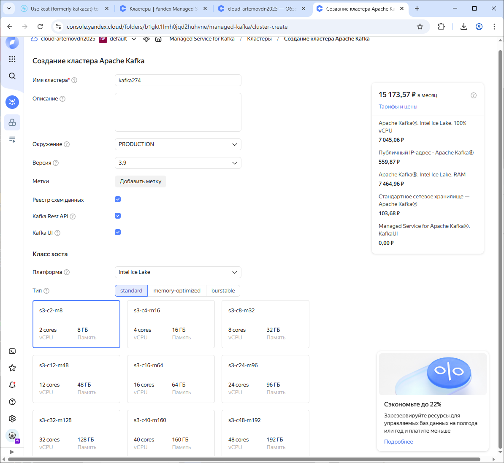
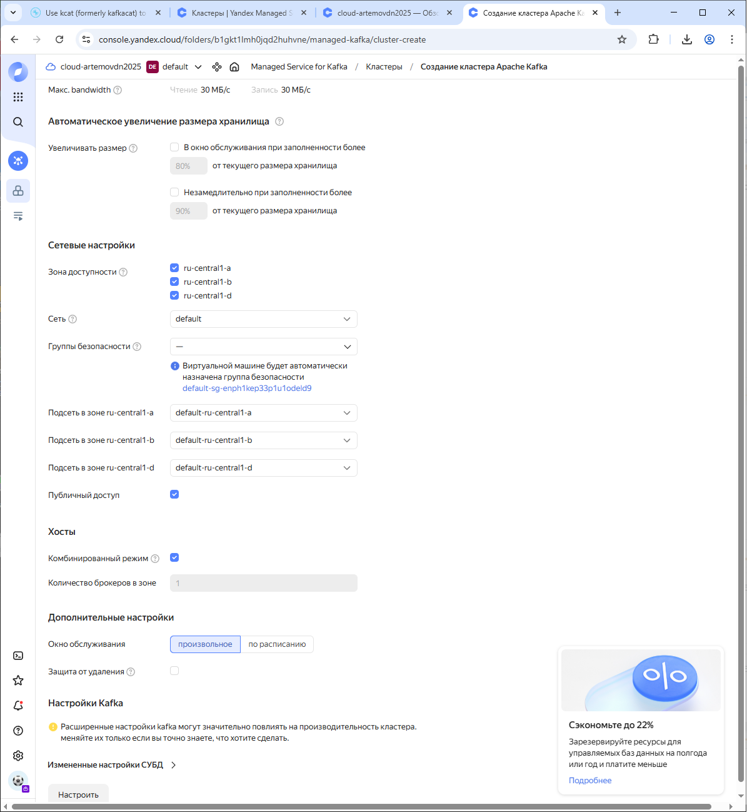
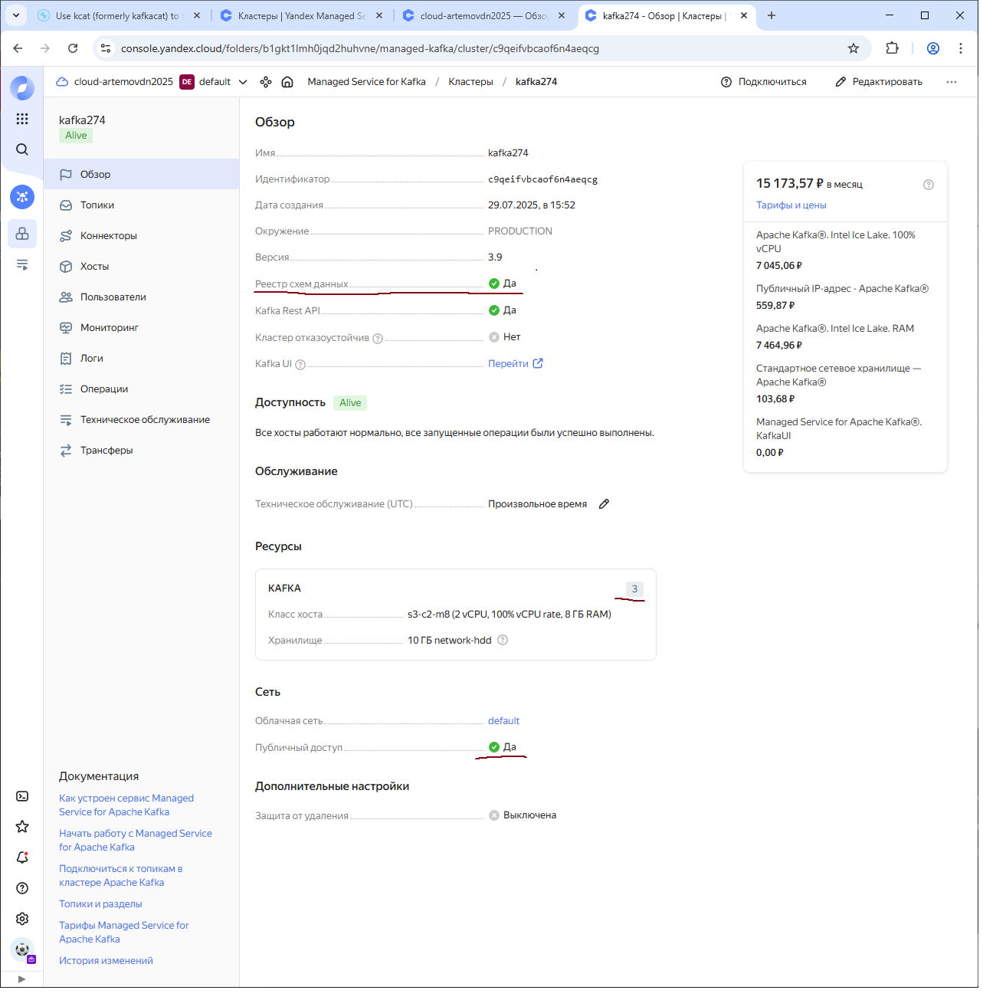
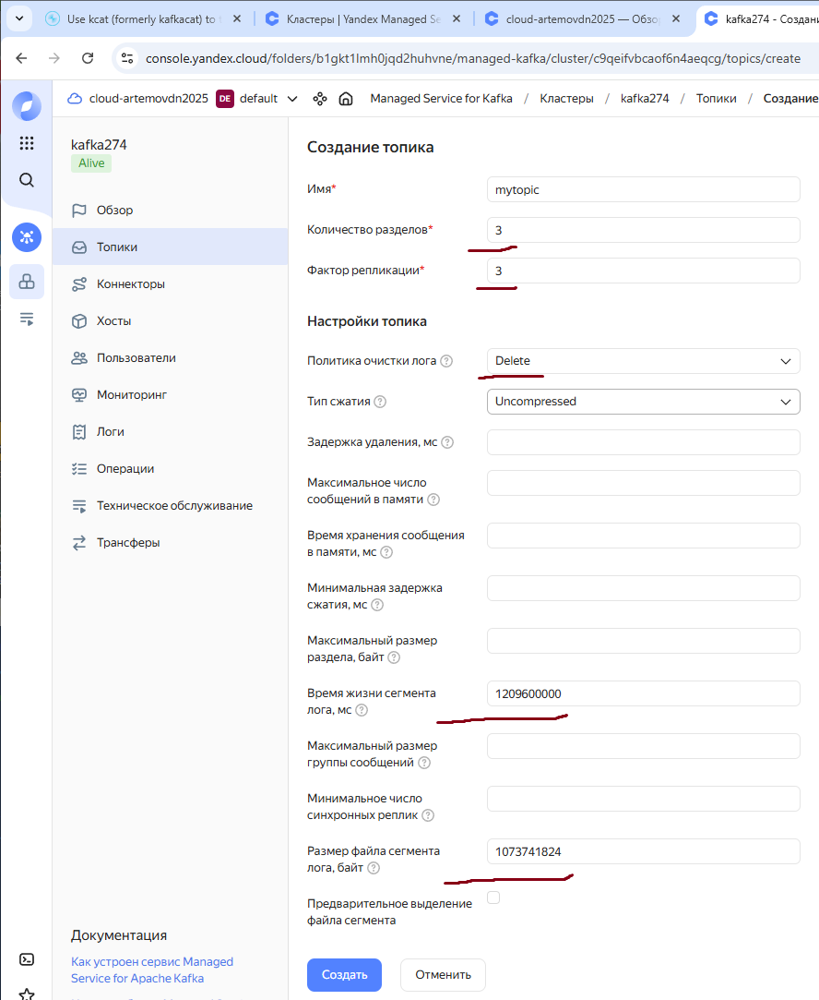
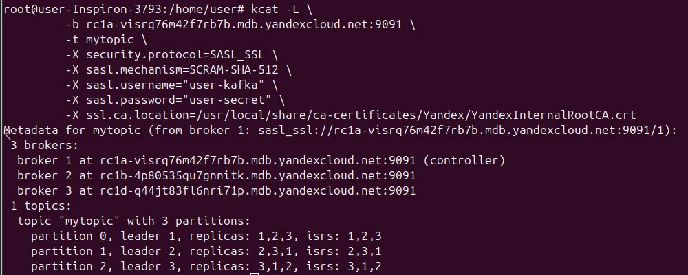
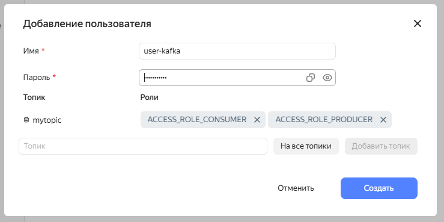
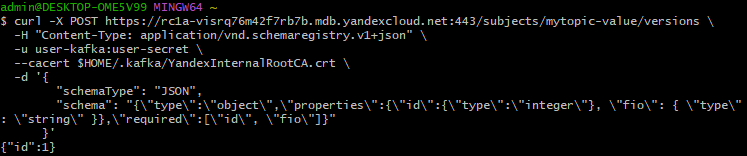
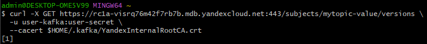
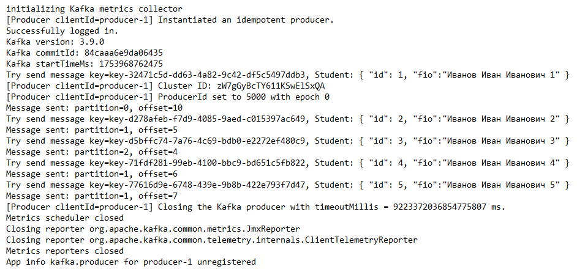
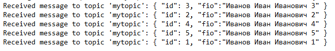

## Описание проекта

Проект разворачивает Kafka кластер в Yandex Cloud.
Также в проекте есть простые продюсер и консумер для отправки и приема тестовых сообщений.

### Классы и структура:
- `kafka_spring_consumer\kafka-creds\kafka.truststore.jks` – truststore для подключения к брокеру.
- `kafka_spring_consumer\src\main\java\com\example\demo\SpringBootApplication.java` – класс для запуска SpringBoot приложения.
- `kafka_spring_consumer\src\main\java\com\example\demo\service\KafkaConsumer.java` – консьюмер для топика.
- `kafka_spring_producer\kafka-creds\kafka.truststore.jks` – truststore для подключения к брокеру.
- `kafka_spring_producer\src\main\java\com\example\demo\SpringBootApplication.java` – класс для запуска SpringBoot приложения.
- `kafka_spring_producer\src\main\java\com\example\demo\service\MyKafkaProducer.java` – продюсер для топика.
- `schema.json` – cхема данных.
- `Producer.log` – лог продюсера.
- `Consumer.log` – лог консумера.

## Описание выполненных шагов

### Шаг 1. Развернул Kafka
- Выбрал минимальные параметры для кластера (s3-c2-m8), так как для учебы требуется передача минимального набора данных
- Включил Реестр схем данных
- Включил Kafka Rest API
- Включил Kafka UI

- Включил Публичный доступ

- Создал кластер

### Шаг 2. Настроил хранение данных
- Создал топик в соответсвии с заданием

- Вывел результат с помощью kcat

- создал пользователя `user-kafka` с необходимыми ролями

### Шаг 3. Настроил Schema Registry
- Создал и сохранил схему в schema.json
- Зарегистрировал схему командой

- Вывел зарегистрированные схемы

- Вывел версию схемы

### Шаг 4. Проверка работы
- Запустило продюсер для отправки сообщений в Kafka (логи в файле Producer.log)

- Запустило консьюмер для приема сообщений из Kafka (логи в файле Consumer.log)

